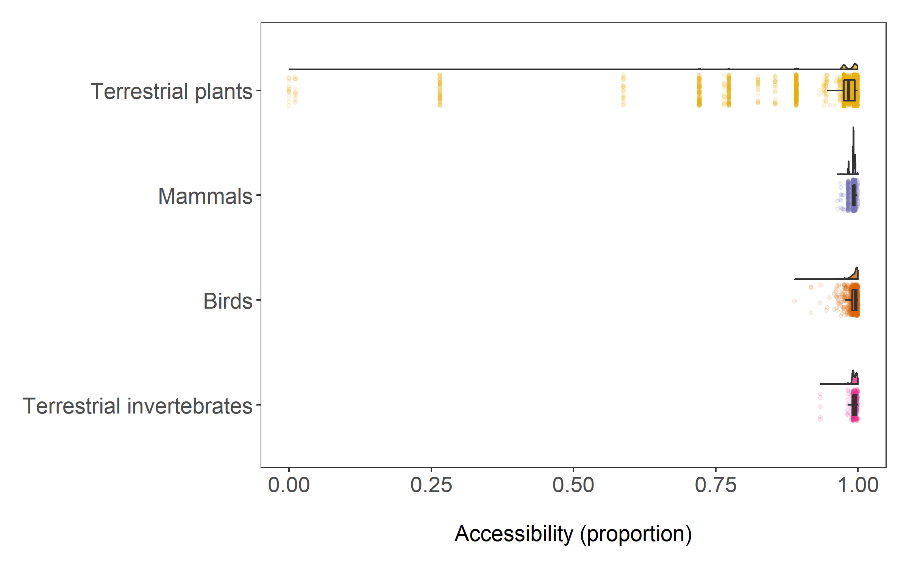

# Appendices

## Appendix A: Sensitivity analyses

I conducted two sensitivity analyses to explore my data further. Firstly, I conducted an analysis to test the sensitivity of scale, modelling accessibility extractions at 1km², 50km² and 100km². Secondly, in a post-hoc analysis I used a subset of my data that only included plants, as this was the taxon that was most equally distributed across levels of accessibility. All model terms were kept equal to the original model outlined above; except when I modelled plants, I removed the taxa fixed effect.

```{r sensitivity plants, echo=F, fig.cap="\\label{fig:fig1} My study looks at three different aspects related to biodiversity change.*A* Conceptual diagrams of my predictions. *B* Workflow (figure inspired by Daskalova, 2019).",out.width = '90%',fig.show='hold',fig.pos="H", fig.align='center'}

```

```{r sensitivity scale, echo=F, fig.cap="\\label{fig:fig1} My study looks at three different aspects related to biodiversity change.*A* Conceptual diagrams of my predictions. *B* Workflow (figure inspired by Daskalova, 2019).",out.width = '90%',fig.show='hold',fig.pos="H", fig.align='center'}

```

## Appendix B: Additional figures

```{r fake ll, echo=F, fig.cap="\\label{fig:fig1} My study looks at three different aspects related to biodiversity change.*A* Conceptual diagrams of my predictions. *B* Workflow (figure inspired by Daskalova, 2019).",out.width = '90%',fig.show='hold',fig.pos="H", fig.align='center'}

```

```{r hist acc and hpd, echo=F, fig.cap="\\label{fig:fig1} My study looks at three different aspects related to biodiversity change.*A* Conceptual diagrams of my predictions. *B* Workflow (figure inspired by Daskalova, 2019).",out.width = '90%',fig.show='hold',fig.pos="H", fig.align='center'}

```

```{r acc across taxa, echo=F, fig.cap="\\label{fig:fig1} My study looks at three different aspects related to biodiversity change.*A* Conceptual diagrams of my predictions. *B* Workflow (figure inspired by Daskalova, 2019).",out.width = '90%',fig.show='hold',fig.pos="H", fig.align='center'}

```

```{r protected areas, echo=F, fig.cap="\\label{fig:fig1} My study looks at three different aspects related to biodiversity change.*A* Conceptual diagrams of my predictions. *B* Workflow (figure inspired by Daskalova, 2019).",out.width = '90%',fig.show='hold',fig.pos="H", fig.align='center'}

```

```{r model duration, echo=F, fig.cap="\\label{fig:fig1} My study looks at three different aspects related to biodiversity change.*A* Conceptual diagrams of my predictions. *B* Workflow (figure inspired by Daskalova, 2019).",out.width = '90%',fig.show='hold',fig.pos="H", fig.align='center'}

```

## Appendix C: Model convergence and outputs

```{r model convergence simp6, echo = FALSE, fig.cap="\\label{fig:fig1} put figure caption",out.width = '60%',fig.show='hold',fig.pos="H", fig.align='center'}
load("outputs/mo_tu_simp6.RData")
plot(mo_tu_simp6)
```

```{r model convergence plants, echo = FALSE, fig.cap="\\label{fig:fig1} put figure caption",out.width = '60%',fig.show='hold',fig.pos="H", fig.align='center'}
load("outputs/mo_tu_simp_plants.RData")
plot(mo_tu_simp_plants)
```


```{r model tidying, include=F}
library(tidyverse)
library(tidybayes)
library(bayesplot)
library(modelr)
library(sjstats)
library(knitr)
library(kableExtra)
load("outputs/mo_tu_simp6.RData")
load("outputs/mo_tu_simp_plants.RData")
table_m <- parameters::model_parameters(mo_tu_simp6, type = "all", digits = 2)
table_plants <- parameters::model_parameters(mo_tu_simp_plants, type = "all", digits = 2)
```


```{r model table simp6, echo = FALSE, fig.align='center'}
knitr::kable(table_m, caption = "Full outputs of the model testing change in vulture population abundance over time (using random slopes and intercepts for population id).") %>% 
  kable_styling(latex_options = c("striped", "scale_down","HOLD_position"))
```

```{r model table plants, echo = FALSE, fig.align='center'}
knitr::kable(table_plants, caption = "Full outputs of the model testing change in vulture population abundance over time (using random slopes and intercepts for population id).") %>% 
  kable_styling(latex_options = c("striped", "scale_down","HOLD_position"))
```

## Appendix D: R Code