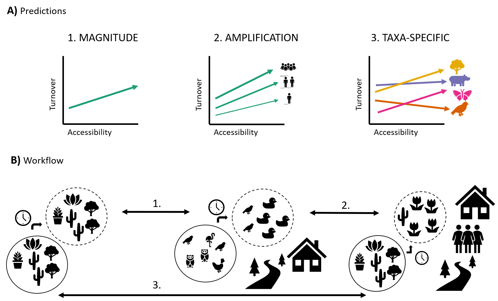

# Introduction

## Background
Humans have modified 75% of terrestrial land cover, leading to major pressures on the biosphere and its inhabitants (IPBES, 2019). Growth of human population and the expansion of cities and road networks, which predicate UN’s equity agenda by advancing accessibility (UN, 2015), are expected to intensify pressures on the natural environment (IPBES, 2019). Large-scale human activity has altered abundance, richness and composition of ecological assemblages in complex ways (Dornelas et al., 2014; Vellend et al., 2017; Hillebrand et al., 2018; Magurran et al., 2018). Even when consequences on ecosystem processes and resilience are not fully understood (Vellend et al., 2017), biodiversity is increasingly unstable (Hillebrand). Disentangling drivers of complex biodiversity change and establishing effective conservation practices without compromising human development is an urgent issue. Currently, we only have a limited quantitative understanding of how global change drivers, such as large-scale human activity, influence local patterns of biodiversity over time. Despite calls for more encompassing tests of the effects of global change drivers on biodiversity changes, research has mostly focussed on individual types of environmental change such as forest loss and land-use change. Recent global databases of large-scale human activity such as the accessibility to cities maps, together with long-term biodiversity time-series allow us to quantitatively test more encompassing global change drivers’ effects on biodiversity change. Biodiversity change linked to large-scale human activity can provide the information and predictions needed for better international policy making in the light of our rapidly changing Anthropocene.

Biodiversity changes depend on the scale and metric of observation (McGill et al., 2015; Chase et al., 2019). On a global scale, biodiversity richness is declining as is reflected in increasing global extinction rates. Contrary, on a local scale, biodiversity richness seems to be stable or even increasing (Butchart et al., 2010; Dornelas et al., 2014, ISla?). A potential explanation can be found when looking at species turnover (changes in the composition of ecological communities), which can reveal changes in biodiversity that are often uncoupled from changes in species richness (Dornelas). Communities seem to undergo replacement of some species by others with no overall change in the total number. Although turnover is part of natural community persistence processes to some extent, current levels exceed baseline trends of existing ecological models (Dornelas, Magurran 18). This highlights that the biodiversity crisis is not about decline but rather about large-scale reorganization of communities leading to homogenization across space (Blowes et al., 2019). Homogeneity leads to a decrease in biodiversity over larger scales and has serious implications on the ability of species communities to adapt to future environmental changes (Eriksson and Hillebrand, 2019). Thus, to comprehend biodiversity change across scales and make prediction for the future, it is important to understand changes in communities’ compositions at the local scale.

Biodiversity change and its attribution to a specific driver can be assessed through different methods, each with its own advantages and disadvantages. Based on differences in methods used, there is an ongoing controversy of local biodiversity changes driven by human activity. Research that used space-for-time and modelling approaches generally report negative trends of biodiversity change following human impact, such as land-use change. Similarly, absence of human activity is reported as beneficial in reducing extinction rates (Di Marco). Research that uses temporal trends and real-world data reports a more complex picture of biodiversity change with both negative and positive cooccurring. Space-for-time models exploit much data but have been criticised for the uncertainty in the assumption that time can be substituted for space. Especially when researching biodiversity change, this approach is lacking important temporal aspects such as ecological lags and community self-regulation, with the consequent risk of overestimating the effect of global change drivers. Temporal assessments based on real world data can infer driver-response relationships by observing fluctuations through time. These attributions heavily depend on long-term availability and matching of data of both driver and response variables under observation. Assessing biodiversity changes and their relationship to global change driver could benefit from looking at real-world temporal data.

Biodiversity change can be driven by multiple human impacts simultaneously. Humans have impacted the natural environment through a variety of activities such as habitat change, exploitation, pollution, climate change and introduction of invasive species. Previous studies have focussed on individual drivers of biodiversity change, such as forest loss and land-use transitions, ignoring the fact that several drivers can be present at the same time. Therefore, these studies are limited in their extent to capture potential interactions of simultaneous human activities. To implement effective conservation measures it is not sufficient to look at one driver in isolation, but we seek to gain a more general understanding of biodiversity changes in reaction to large-scale human activities acting together. The accessibility to cities metric, a measure of the closest travel time to the next urban centre, can be seen as a proxy for multiple human influences. An increase in accessibility is tightly linked with increases of road network, urbanisation and human activities linked to urbanisation. This metric can capture changes to the environment and its inhabitants such as habitat fragmentation, land-use change, alien species and habitat loss as a cumulative measure. It allows to observe outcomes of potential additive, synergistic or antagonistic interactions between such environmental changes, as they are likely to co-occur and interact. Not only multiple drivers, but also the amount of exposure can influence biodiversity changes. It can be hypothesized that biodiversity changes might be amplified with higher exposure to human activities, driven by human population density. Biodiversity changes are influenced by co-occurring drivers of human activities with potential interaction effects and are thus captured better with a metric that accounts for a variety of human activities.

Biodiversity change is dependent on both the exposure to various drivers and species responses to environmental change (Foden, 2013). Species vulnerability varies with functional traits such as life history, range-size and niche breadth. Examining them separately for taxa can improve conservation strategy targeting. Species with small population sizes, high habitat specificity and restricted geographic extent are more likely to go extinct locally, thus increase the likelihood of biodiversity change. Less mobile species might struggle to disperse and find a suitable refuge, as the exposure to environmental change increases. Small population sizes are more prone to undergo stochastic fluctuations (Taylor’s power law), as well as higher inbreeding rates with resulting reduced fitness. High habitat specificity means that colonization of new areas is restricted by limited habitat preferences. Species traits associated with higher vulnerability shared across a taxon make it more prone to declines and extinctions. Studies looking at different species responses to a range of human impacts have found both positive and negative responses among taxa, related to functional traits. Understanding biodiversity changes on a taxa-specific level allows for more specific targeting of conservation efforts.

## Objectives and research questions
My aim is to quantify how global change drivers influence ecological communities over time. Specifically, I will focus on large-scale human activity captured in the accessibility to cities, and human population density and their relationship with temporal changes in community composition overall and across taxa. To achieve this, I investigate the influence of accessibility to cities on ecological assemblages worldwide and across taxa (birds, mammals, plants and invertebrates) by analysing change in 5787 time series, addressing the following research questions (RQ):

1. Do sites with higher accessibility to cities experience more changes in assemblage composition over time (temporal turnover) than locations with lower accessibility?
	- How does the duration of ecological monitoring influence the magnitude of detected
	  temporal turnover trends?

2. How is temporal turnover influenced by an interaction between human population density and accessibility?

3. How does temporal turnover of assemblage composition respond to levels of accessibility across taxa (birds, mammals, terrestrial invertebrates, terrestrial plants)?


## Research hypotheses
I hypothesize that there will be a positive relationship between higher accessibility to cities and greater temporal turnover. The magnitude of temporal turnover increases for sites which have been monitored over longer durations. The relationship between accessibility to cities and temporal turnover is steeper when human population density is higher. When looking at individual taxa, I hypothesize that taxa responses will vary for temporal turnover across levels of accessibility, with both positive and negative relationships present. Those hypotheses will be tested against the null hypotheses of no relationship between levels of accessibility and temporal turnover, no amplification of effect when human population density is higher and no difference in relationships between temporal turnover and accessibility across taxa.

## Predictions
I predict greater temporal turnover with greater magnitude of accessibility, as alterations of the natural environment caused by human activities facilitate colonisations of some species, while also leading to local extinctions. I predict greater temporal turnover in sites which have been monitored over longer durations, as the effect of turnover becomes more apparent over time. I predict the relationship between accessibility and temporal turnover to be steeper, when human population density is higher, as high human population density accelerates pressures on the natural systems, leading to higher turnover.  I predict both positive and negative trends to be present among taxa, as they differ in functional traits and thus in their vulnerability to environmental changes.
If I find support for my null hypotheses, this will indicate that the metric accessibility cannot sufficiently capture direct and indirect human impacts affecting biodiversity change, but also questions whether the current conservation emphasis to preserve wilderness areas is enough. If the results are in line with my alternative hypotheses, this will demonstrate the importance of humanly undisturbed places for the conservation of biodiversity.

```{r conceptual diagram, echo=F, fig.cap="\\label{fig:fig1} My study looks at three different aspects related to biodiversity change.*A* Conceptual diagrams of my predictions. *B* Workflow (figure inspired by Daskalova, 2019).",out.width = '90%',fig.show='hold',fig.pos="H", fig.align='center'}

```