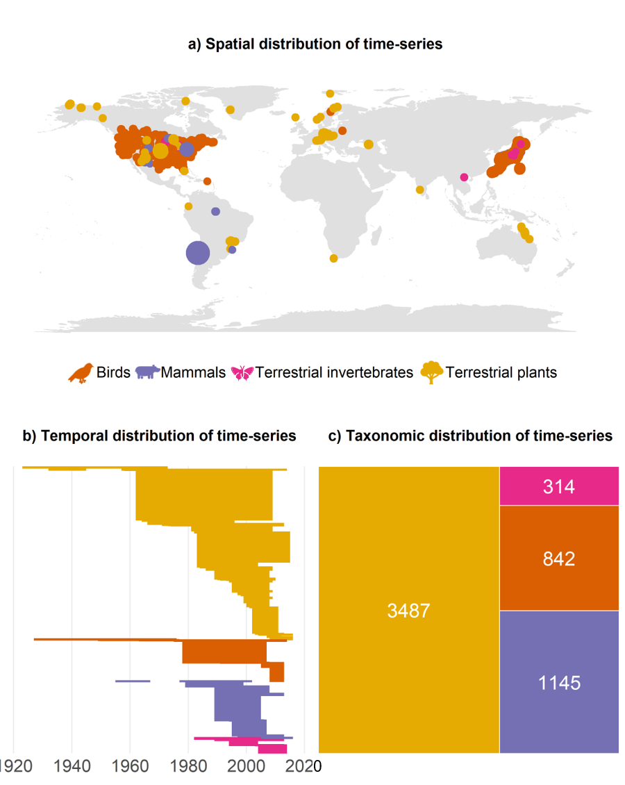

# Methods

In this study, I assess how 5787 ecological assemblages over time across four taxa (birds, mammals, invertebrates and plants) respond to levels of accessibility and human population density. I used three global databases to quantitively test the relationship of ecological communities and large-scale anthropogenic activity. 

## Databases
**BioTIME Database – biodiversity time series data**

I analysed 5787 time series from 181 different studies from 1023 unique terrestrial locations around the world, covering a range of taxa, including birds, mammals, invertebrates and plants (Dornelas et al., 2018) that make up a part of the BioTIME database as of 12th of March 2020. I did not predetermine sample size but used all available data that met my inclusion criteria: part of the terrestrial realm, minimum study duration of 5 years, at least 15 studies per taxa, no more than 5000 time-series per study, time-series fixed to one location and at least 2 survey points per time-series. Time-series that had no unique coordinates for their location, were located with the coordinates given by the study they belonged to. The resulting sample sizes across space, time and taxa can be found in Figure 2.

The time-series used represent repeated studies of species abundance and identity of all species found within an ecological community. The data collection of BioTIME was consistent within studies but not between studies. 

Other research that used BioTime partitioned studies with large extent and consequently used sample-based rarefaction to standardise sampling within each time-series. My research does not conform with previous methods as 64 % of my studies’ areas were equal to or smaller than 1km².  37 % of studies were located in protected areas. The duration varied across time-series, ranging from 1923 – 2016, with a mean duration of 19 years (standard deviation of +/- 13 years). Mean time-series per study were 64 (+/- standard deviation of 145).

```{r panel biotime, echo=F, fig.cap="\\label{fig:fig1} My study incorporates biodiversity time-series data across space, time and taxa (gigure inspired by Daskalova, 2019).",out.width = '90%',fig.show='hold',fig.pos="H", fig.align='center'}

```

**Accessibility to cities 2015 data**

To quantify large scale human impact, I extracted an accessibility to cities metric from the Malariaatlas project Accessibility to cities 2015 global database. This database calculates least-cost-path land-based travel time to the nearest densely populated area (between 85 degrees north and 60 degrees south) at a 30 arc seconds resolution (approximately 1km at equator). Areas with >1,500 inhabitants/km² or a majority of built-up land cover types coincident with a population centre of at least 50,000 inhabitants are defined as densely populated areas. This dataset is available for the nominal year of 2015.

In the main figures, I used the inverses of travel time to nearest densely populated area, so that high values correspond to higher hypothesized human effect.

**Human population density dataset**

To estimate human population density, I derived data from the Gridded Population of the World, Version 4: Population Density, Revision 11 database (CIESIN, 2018). Human population density was defined as number of persons per square kilometre, based on national censuses counts and population registers. Data is available at a 30 arc-second resolution (approximately 1km at equator). To match the timing of the accessibility dataset, I used the dataset for the nominal year of 2015.

## Data processing
All data processing was conducted in R v. 3.6.1. (REF R).

I quantified temporal changes in community composition within sites, as the turnover component of beta diversity (species replacement rather than abundance) at the last data point available relative to the first observation data point within each time-series using {vegan} and {betapart}. Turnover, as opposed to nestedness, was the dominant part of biodiversity change in the BioTIME dataset (REF). For study records that were not count data, I converted density and biomass records into presence/absence, so no data needed to be excluded. Temporal turnover is bound between zero and one, where zero is no change in community composition and one indicates that all original species have been replaced.

I harmonized both accessibility and human population density dataset to a standard global grid size of 25km² by taking the mean value of the grid cell when extracting the values with the {raster} package. I considered an area > 1km² to be more representative of the impact-influence relationship. My analyses were not sensitive to cell sizes over 25km² (tests from 25km² to 100km², but analysis showed higher values with similar slope for 1km²). I scaled the scores extracted between zero and one, where zero is not accessible/low human population density and one is very accessible/ high human population density. 

To account for spatial autocorrelation, I created and assigned global grid cells to each time-series using {dggridr}. The grid cells covered areas of resolution 12, which is equivalent to an area of around 100km². 

## Data analysis
I conducted all statistical analysis in R v. 3.6.1. (REF R). To quantify the relationship of accessibility and human population density across taxa on temporal turnover of ecological communities, I used mixed effects models in a Bayesian modelling framework based on a Stan computational framework and accessed through the {brms} package (REF). I based the models on a zero one inflated beta distribution to reflect the properties of turnover (bound between, and including, zero and one). I assumed a Bernoulli distribution for values of zero and one, and a beta error distribution for values between zero and one. I fitted the model with only one intercept.

I modelled temporal turnover as my response variable. Fixed effects were accessibility (proportion) and duration of the time-series (RQ 1). I did not consider centring of duration necessary as the variation was relatively little within. Model convergence could not be achieved with the interaction term between accessibility and human population density, so latter was added as a fixed effect without an interaction (RQ 2). Neither could I achieve model convergence when allowing each taxon to have a random slope (nor intercept) with accessibility, so I added taxa as a fixed effect (RQ 3). I adjusted research question 2 and 3 accordingly when presenting my results and discussion. To account for confounding effects within the same study as the methods were consistent within but not among studies. Study ID was included as a random effect. To account for spatial autocorrelation the global grid cell variable was added as a random effect. I used {ggpredict} to calculate model predictions. I assumed the said model set-up to be the optimal balance between requirements of the data and feasibility.

I used the default priors which are weakly informative as I had no ecological explanation to assume otherwise. The default priors can be found in the code in the appendix.
I ran the models with 4000 iterations, with a warmup of 1000 iterations on 4 chains. I assessed convergence visually by examining trace plots and Rhat values (ratio of the effective sample size to the overall number of iterations. Values close to one indicate convergence).

As I used a Bayesian framework, my inferences were based on the posterior distribution of each fixed effect. They were considered significant if the lower and upper 95% credible intervals (CI) did not overlap zero. I concluded all results, regardless of the direction or magnitude of the effect size.

The full R script, the link to the repository and to my preregistration and description of sensitivity analyses can be found in the appendix X.