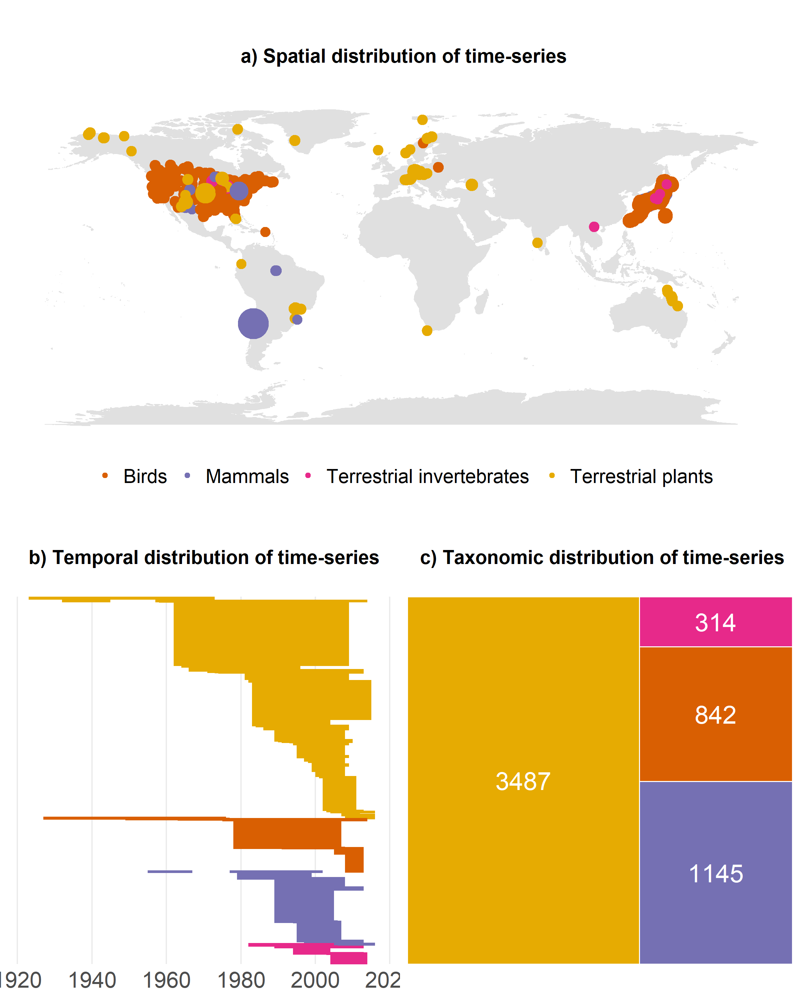

# Methods

In this study, I ask how the magnitude of accessibility and its interaction with human population density is affecting 5787 ecological assemblages over time across four taxa (birds, mammals, invertebrates and plants). To quantitively test the consequences on ecological communities of large-scale anthropogenic activity globally, I used 3 global databases.

## Databases
**BioTIME Database – biodiversity time series data**
The currently largest database of temporal community time series spans 4,970,128 (UPDATE) records of abundances and numbers of species globally, covering a range of taxa, including birds, mammals, invertebrates and plants (Dornelas et al., 2018). I analysed 5787 time series from 181 different studies from terrestrial (UNIQUE?) places around the globe that are part of the BioTIME database as of 12/03/2020. I used all available data that met my inclusion criteria: part of the terrestrial realm, minimum study duration of 5 years, at least 15 studies per taxa, no more than 2000 plots per study, plot fixed to one location and at least 2 survey points per plot. The resulting sample sizes across space, time and taxa can be found in Figure 1.
The time-series used represent repeated studies of species abundance and identity of all species found within an ecological community. The data collection of BioTIME was consistent within studies but not between studies. 
Contrary to other studies which portioned studies with large extent and consequently used sample-based rarefaction to standardise sampling within each time-series, XX% of my studies were within 1km². X% of studies were in protected areas. Duration varied across time-series, ranging from 1900 – 2020, with a mean duration of XX. 
The BioTIME database is limited in its even representation of different taxa and latitudes. It underrepresents reptiles and amphibians and the tropics and polar regions (see Figure 1).

```{r panel biotime, echo=F, out.width = '90%'}

```

**Accessibility to cities 2015 data**
To quantify large scale human impact, I extracted an accessibility to cities metric from the malariaatlas project Accessibility to cities 2015 global database. This database calculates least-cost-path land-based travel time to the nearest densely populated area (between 85 degrees north and 60 degrees south) at a 30 arc seconds X and Y resolution. Areas with >1,500 inhabitants/km² or a majority of built-up land cover types coincident with a population centre of at least 50,000 inhabitants are defined as densely populated areas. 
In the main figures, the inverses of distance to roads and travel time to major population centre (proximity to roads and accessibility) were presented so that high values corresponded to higher hypothesized human effect

**Human population density dataset**
I derived population density data from the Gridded Population of the World, Version 4: Population Density, Revision 11 database (CIESIN, 2018). Human population density was defined as number of persons per square kilometre, based on national censuses counts and population registers. Data is available 2015 at a 30 arc-second resolution.

## Data processing
All data processing and statistical analysis was conducted in R v. 3.6.1. (REF R).
I quantified temporal changes in community composition within sites, as the turnover component of beta diversity (species replacement rather than abundance) at the last data point available relative to the first observation data point within the time period outlined above. This was the dominant part of biodiversity change in the BioTIME dataset (REF). For study records that were not count data, density records were converted into presence/absence. 
Turnover is bound between zero and one, where zero is no change in community composition and one indicates that all original species have been replaced.
I harmonized both accessibility and human population density dataset to a standard global grid size of 25km² by taking the mean value of the grid cell when extracting the values with {raster}. I bound the scores extracted between zero and one, where zero is not accessible/low human population density and one is very accessible/ high human population density, respectively.
To account for spatial autocorrelation I created and assigned global grid cells using {dggridr}. The grid cells covered areas of resolution 12, which is equivalent to around 100km². 

## Data analysis
All statistical analysis was conducted in R v. 3.6.1. (REF R). To quantify the influences of accessibility and human population density on turnover of ecological communities, I used a hierarchical Bayesian modelling framework based on a Markov chain Monte Carlo (MCMC) method. All Bayesian models were created in a Stan computational framework and accessed through the {brms} package (REF). The models are based on a zero one inflated beta distribution to reflect the properties of turnover (bound between, and including, zero and one). Because only X% of time series had experienced complete species replacement (turnover =1) and only X% had experienced no species replacement at all (turnover =0), I assumed a Bernoulli distribution. 
Explanation models response variables, fixed effects, random effects
STATE MODEL EQUATION?

I modelled turnover as my response variable. Fixed effects were (scaled) accessibility and duration of the time-series. Area was not included as a fixed effect, as it did not have a significant effect on turnover. Similarly, model convergence could not be achieved with the interaction term between accessibility and human population density, so latter was added as a fixed effect without the interaction. As model convergence could not be achieved with a taxa random effect allowing for each taxa to have its own slope with accessibility, it was added as a fixed effect. To account for autocorrelation of the method applied, Study ID was included as a random effect. To account for spatial autocorrelation the global grid cell variable was added as a random effect.
Centering of duration was not necessary as the variation was relatively little.
Due to the inclusion of several model variables, model predictions were calculated using the tidybayes package and ggpredict for predicting the taxa fixed effect. 

Model explanation (priors, iterations). 
The models were based on a zero one inflated beta distribution.(HERE OR BEFORE?)
I used the default priors as they are weakly informative and I have no ecological backup to assume otherwise. The default priors are/ can be found in the code in the appendix.

I ran the models with 4000 iterations, with a warmup of 1000 iterations; 4 chains?. Adapt alpha was set to 0.85. I assessed convergence visually by examining trace plots and by using Rhat values.
As I will be using a Bayesian framework, my inferences will be based on the posterior distribution of each fixed effect. They will be considered significant if the lower and upper 95% credible intervals (CI) don’t overlap zero. I concluded  all results, regardless of the direction or magnitude of the effect size.

Alternatives to measuring variables?

Sensitivity analysis
I conducted sensitivity analysis to test the validity of limitations of my data. I ran an analysis just with plants, as this taxa displayed was most equally distributed across levels of accessibility. Furthermore, I conducted analysis to test the sensitivity of scale, modelling accessibility and hpd extractions of 1km², 50km² and 100km². Thirdly, I ran a model with data included from only 1970-2015 to better temporally match the datasets to the nominal points of accessibility and hpd of 2015. All other model terms were kept equal to the model outline above; except when modelling plants, the taxa fixed effect was removed.
Richness change?

Full R script in appendix, preregistration link
