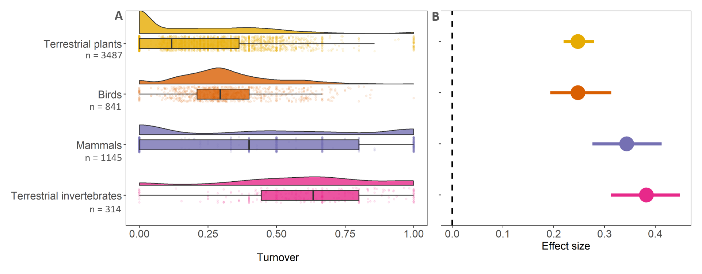

# Results

## Temporal turnover and accessibility (Research Question 1)

Contrary to my predictions, I found that temporal turnover decreased as accessibility increases across the 5787 time-series surveyed (slope = -1.20, CI = -2.09 to -0.32, Figure 3, see Table 1 for full model outputs). On average, for every 10% increase in accessibility, turnover decreases by 1.6 %. Notably, when taking the last census point as a baseline (lowest point of slope located at high accessibility), the ecological assemblages across levels of accessibility have experienced average 24% replacement of their species (as turnover is bound between 0 and 1) over their time-period monitored (average duration of 19 years).  63% of time-series experienced some turnover (turnover > zero) and only ~ 7% of time-series analysed experienced complete turnover of communities (turnover = one). As 90.5% of data points had an accessibility score of 0.9 and above, there is higher uncertainty around the main effect at lower values of accessibility than at higher values, indicating the need to take the high value of temporal turnover at low accessibility with caution.

In line with my predictions, the duration of the observation influenced the magnitude of the detected temporal turnover trends, with higher temporal turnover observed for longer monitoring duration of sites (Figure 3, also see Figure 12 in appendix B).  

```{r RQ1, echo=F, fig.cap="\\label{fig:fig1} Temporal turnover decreased as accessibility increases across the 5787 time-series surveyed using a Bayesian mixed model (slope = -1.20, CI = -2.09 to -0.32, see Table 1 for full model outputs). Grey points represent raw data. Lines and error bands represent model predictions and 95 percent credible intervals, respectively. Colour coding of lines represent differing duration of monitoring of time-series. The marginal density plots represent accessibility (top density plot) and temporal turnover (right density plot) distributions across all time-series surveyed. See model Rhat values in appendix confirming model convergence.",out.width = '80%',fig.show='hold',fig.pos="H", fig.align='center'}

knitr::include_graphics("outputs/graph_acc_den.png")
```


## Temporal turnover and human population density (Research Question 2 modified)

Looking at the relationship between temporal turnover and human population density (without the interaction as that model did not converge), I found that temporal turnover neither increased nor decreased as human population density increases across the 5787 time-series surveyed (slope = -0.22, CI = -0.49 to 0.05, Figure 4, see Table 1 for more model outputs). Notably, when taking the last census point as a baseline (lowest point of slope located at high human population density), the ecological assemblages have experienced 22% replacement of their species (as turnover is bound between 0 and 1)  over their time-period monitored (average duration of 19 years). Contrary to the distribution of accessibility falling into higher spectrum, 96.4% of data points have human population density score of 0.1 and below.  

```{r RQ2, echo=F, fig.cap="\\label{fig:fig1} Temporal turnover showed no directional relationship with human population density across the 5787 time-series surveyed using a Bayesian mixed model (slope = -0.22, CI = -0.49 to 0.05, see Table 1 for full model outputs). Grey points represent raw data. Lines and error bands represent model predictions and 95 percent credible intervals, respectively. The marginal density plots represent human population density (top density plot) and temporal turnover (right density plot) distributions across all time-series surveyed. See model Rhat values in appendix confirming model convergence.",out.width = '80%',fig.show='hold',fig.pos="H", fig.align='center'}
knitr::include_graphics("outputs/graph_hpd_den.png")
```


## Temporal turnover and taxa (Research Question 3 modified)

Looking at the relationship between temporal turnover and taxa (not considering the relationship across levels of accessibility as that model did not converge), I found that all taxa experienced temporal turnover (see Figure 5, Table 1 for full model outputs). Terrestrial invertebrates (slope = 0.99, CI = 0.31 – 1.7, n = 314) and mammals (slope = 0.71, CI = 0.01 – 1.42, n = 1145) experienced higher amounts of turnover relative to birds (slope = 0.11, CI = -0.87 – 1.14, n = 841) and plants (slope = 0, CI = -0.56 – 0.55, n = 3487). Terrestrial invertebrates experienced highest amount of turnover (0.54 times more than plants). The raw data demonstrates high variability of turnover experienced within mammals and lowest variability within birds. The number of time-series sampled for each taxon differed: of all time-series analysed 60% are made up of plants, followed by 20% mammals, followed by 14% birds and only 6% invertebrates. Out of the 37% time-series that showed no turnover at all, plants accounted for 73%.

```{r RQ3, echo=F, fig.cap="\\label{fig:fig1} Temporal turnover was apparent across all taxa surveyed using a Bayesian mixed model. \\textbf{A} Raw data visualisation of turnover across taxa. Split violins represent data distribution, boxplots with mean values and points are raw data. Numbers are sample sizes per taxon. \\textbf{B} Model visualisation for temporal turnover and taxa. Terrestrial invertebrates (slope = 0.99, CI = 0.31 – 1.7) and mammals (slope = 0.71, CI = 0.01 – 1.42) experienced higher amounts of turnover relative to birds (slope = 0.11, CI = -0.87 – 1.14) and plants (slope = 0, CI = -0.56 – 0.55). Error bars represent 95 percentage credible intervals. Dashed line marks the zero-line threshold. See model Rhat values in appendix confirming model convergence.",out.width = '90%',fig.show='hold',fig.pos="H", fig.align='center'}

```