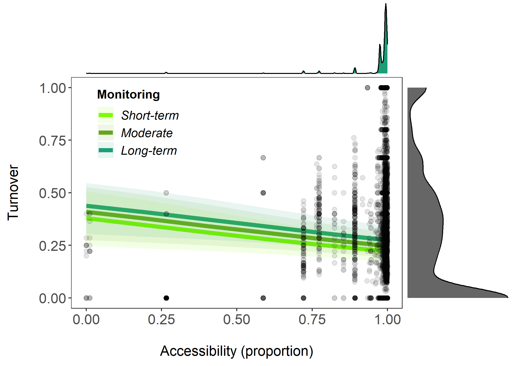

# Results

## Temporal turnover and accessibility (Research Question 1)

Contrary to my predictions, I found that temporal turnover has not increased as accessibility is increasing across the 5787 time-series surveyed (slope = -1.05, CI = -1.59 to -0.51, Figure 1, see Table 1 for more model outputs). On average, for every 10% increase in accessibility, turnover decreases by 1.6 %. In line with my predictions, the duration of the observation influenced the magnitude of the detected temporal turnover trends, with higher temporal turnover observed for longer monitoring of sites. Quantification. Only ~ 7% experienced complete turnover of communities (turnover = 1)  and ~ 37% experienced no turnover at all (turnover = 0). There is high uncertainty around the main effect at lower values of accessibility. As can be seen from the distribution 90.5 % of data points have accessibility score of 0.9 and above.
 
 and that your relationship is driven by random effect things like certain studies really driving the overall relationship with really high accessibility? and there is a lot of uncertainty around the main effect at lower values of accessibility?

```{r RQ1, echo=F, out.width = '90%'}

```

Figure 2. Jaccard turnover has increased for higher levels of accessibility across 5788 time-series globally (slope = 0.05, CI = 0.03 to 0.07, Figure 1, see Table 1 for more model outputs). Grey points represent raw data. Lines and error bands represent model predictions and 95% credible intervals, respectively. Colour coding of lines represent differing duration of monitoring. See trace plots and model Rhat values in appendix confirming model convergence.

## Temporal turnover and human population density (Research Question 2 modified)

Looking at the relationship between turnover and human population density, I found that temporal turnover has not increased as human population density increased across the 5787 time-series surveyed (slope = -1.05, CI = -1.59 to -0.51, Figure 1, see Table 1 for more model outputs). the duration of the observation influenced the magnitude of the detected temporal turnover trends, with higher temporal turnover observed for longer monitoring of sites. Quantification. Uncertainty of main effect is more similar throughout levels of human population density. As can be seen from the distribution 96.4 % of data points have human population density score of 0.1 and below.

```{r RQ2, echo=F, out.width = '90%'}
knitr::include_graphics("outputs/graph_hpd_den.png")
```

Figure 2. Jaccard turnover has increased for higher levels of accessibility across 5788 time-series globally (slope = 0.05, CI = 0.03 to 0.07, Figure 1, see Table 1 for more model outputs). Grey points represent raw data. Lines and error bands represent model predictions and 95% credible intervals, respectively. Colour coding of lines represent differing duration of monitoring. See trace plots and model Rhat values in appendix confirming model convergence.


## Temporal turnover and taxa (Research Question 3 modified)

Looking at the relationship between temporal turnover and each taxa, I found that temporal turnover showed positive relationships across the four taxa surveyed (across the 5787 time-series surveyed) (slope = -1.05, CI = -1.59 to -0.51, Figure 1, see Table 1 for more model outputs). mammals and invertebrates have higher amounts of turnover relative to birds and plants and that invertebrates have the highest turnover. Also plants made up 73% of time-series that showed no turnover (turnover = 0). Raw data shows high variability for mammals, low for birds and plants. But also unequal sampling: 60% of data set is made up of plants, followed by 20% mammals, followed by 14% birds and only 6% invertebrates. Also interesting to see is different distribution of coincidence with PA: Plants and mammals show high coincidence; 39% and 45% respectively and below 5 for both invertebrates and birds.

```{r RQ3, echo=F, out.width = '90%'}
knitr::include_graphics("outputs/panel_taxa.png")
```

